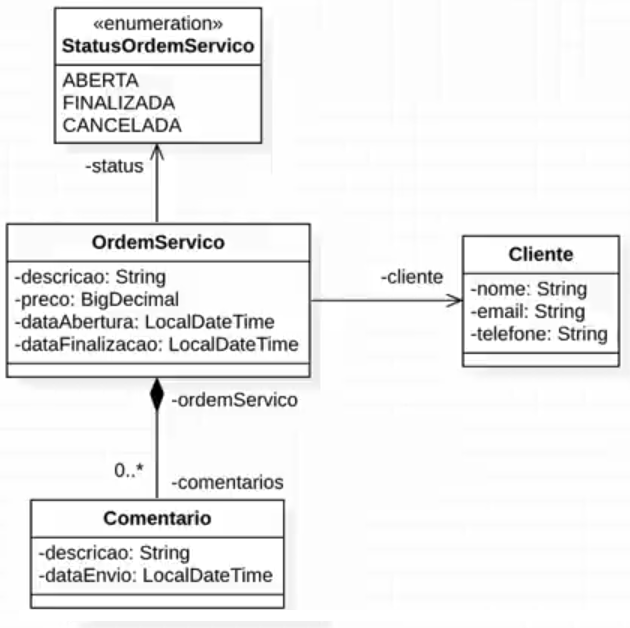

# API Ordem de Serviço utilizando Spring Boot
Requisitos:
* [Java 11](https://www.oracle.com/java/technologies/javase-jdk11-downloads.html)
* [Maven](https://maven.apache.org/)
* [Spring Bootsrap ](https://spring.io/projects/spring-boot)
* [Spring Web](https://spring.io/projects/spring-ws)
* [Spring Data JPA](https://spring.io/projects/spring-data-jpa)
* [MySQL Driver](https://www.mysql.com/products/connector/)
* [Flyway](https://flywaydb.org/)
* [Jakarta Persistence - Hibernate](https://projects.eclipse.org/projects/ee4j.jpa)
* [Jakarta Bean Validation](https://beanvalidation.org/)
* [JUnit](https://junit.org/junit5/)

Adicionado ao projeto:

- [X] [Java 11](https://www.oracle.com/java/technologies/javase-jdk11-downloads.html)
- [X] [Maven](https://maven.apache.org/)
- [X] [Spring Bootsrap ](https://spring.io/projects/spring-boot)
- [X] [Spring Web](https://spring.io/projects/spring-ws)
- [X] [Spring Data JPA](https://spring.io/projects/spring-data-jpa)
- [X] [MySQL Driver](https://www.mysql.com/products/connector/)
- [X] [Flyway](https://flywaydb.org/)
- [X] [Jakarta Persistence - Hibernate](https://projects.eclipse.org/projects/ee4j.jpa)
- [X] [Jakarta Bean Validation](https://beanvalidation.org/)
- [ ] [JUnit](https://junit.org/junit5/)

Estrutura do projeto

